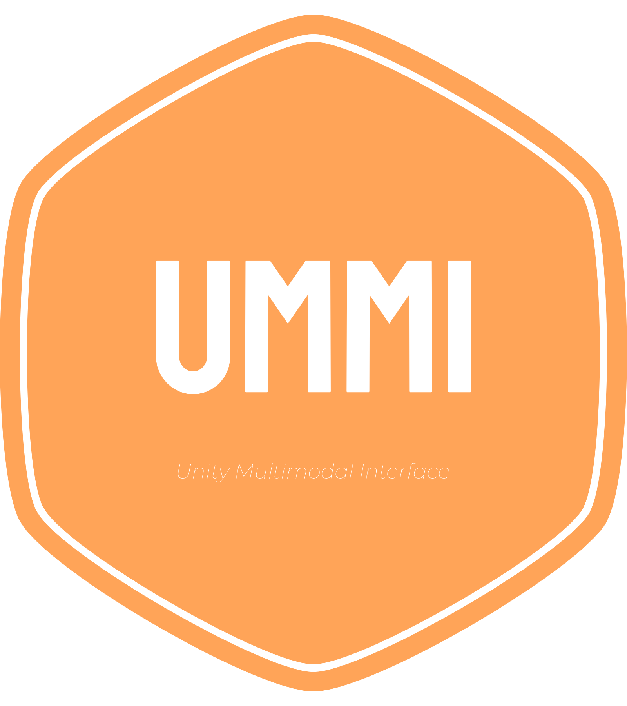

# Unity Multimodal Interface
> Ummi for short, pronounced yummy.
<p align="center">
  
</p>

## Requirements
This project uses .NET packages  
```bash
$ dotnet package Microsoft.ML
$ dotnet add package Microsoft.ML.OnnxRuntime
$ dotnet adaddd package Microsoft.ML.OnnxTransformer
```

## License
MIT Licensed. 
